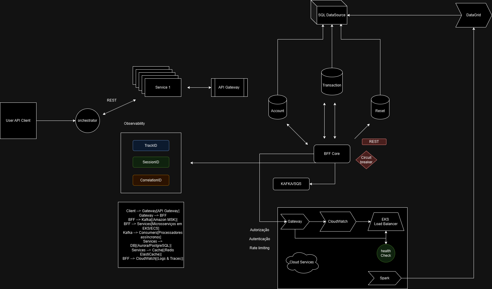
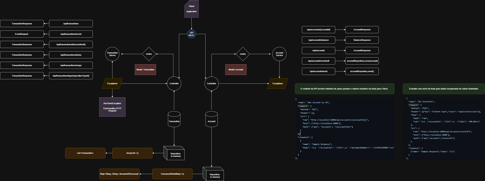

# Core Banking API

A RESTful API built with Spring Boot for managing accounts, balances, and financial transactions. Supports creating accounts, querying balances, and handling deposits, withdrawals, and transfers.

### Key features
> State Reset: Resets all accounts and transactions to the initial state.

> Account Management: Create accounts, configure overdraft limits  and retrieve account information.

> Balance Inquiry: Retrieve the current balance of a specific account.

> Event Operations: Single endpoint to handle three types of financial events:

> Deposit: Adds funds to an account. Automatically creates the account if it doesn’t exist.

> Withdrawal: Deducts funds from an existing account. Fails if insufficient balance or account doesn’t exist.

> Transfer: Moves funds from one account to another, updating both balances atomically. Fails if insufficient funds or account missing.

> Each cardholder (customer) has an account with their details.

> For each operation performed by the customer, a transaction is created and associated with their
  respective account.

> Each transaction has a specific type (normal purchase, withdrawal, credit voucher, or installment purchase).

> Purchase and withdrawal transactions are recorded with negative values.

> Credit voucher transactions are recorded with positive values.


Types of transactions:

1 Normal purchase
2 Installment purchase
3 Withdrawal
4 Credit voucher

Translated with DeepL.com (free version)

## Configuration 

Project was designed with java spring boot and maven. For run project with maven.
Granted install all dependencies with maven and java in your machine. 

- Running with dev config settings
  ```bash
  mvn clean install

- Running with dev config settings
  ```bash
  mvn spring-boot:run -Dspring-boot.run.profiles=dev

## Server Port
[http://localhost:8080/api](http://localhost:8080/api)

## New order of endpoints

> endpoint to request account: /api/accounts
> endpoint to request transaction: /api/transactions

## Endpoints to test

### Accounts
- **Method:** `POST`
- **Endpoint:** `/api/accounts`
- **Description:** Creates a new account.
- **Request Example:**
  ```bash
  curl -X POST "http://localhost:8080/api/accounts" \
  -H "Content-Type: application/json" \
  -d '{"documentNumber":"12345678900"}'

### Get account
- **Method:** `GET`
- **Endpoint:** `/api/accounts/{accountId}`
- **Description:** Retrieves account details by ID.
- **Request Example:**
  ```bash
  curl -X GET "http://localhost:8080/api/accounts/66f4ac85-311e-41b9-8f76-2428ba68b7f4"

### Get Balance
- **Method:** `GET`
- **Endpoint:** `/api/accounts/balance`
- **Description:** Returns the balance of a specific account.
- **Parameters:** account_id (String): The identifyer of the account whose balance is to be retrieved.
- **Request Example:**
  ```bash
  curl -X GET "http://localhost:8080/api/accounts/balance?account_id=66f4ac85-311e-41b9-8f76-2428ba68b7f4"


### Set Overdraft
- **Method:** `POST`
- **Endpoint:** `/api/accounts/overdraft`
- **Description:** Set new value for overdraft limit.
- **Parameters:** account_id (String): The identifyer of the account whose balance is to be retrieved.
- **Request Example:**
  ```bash
  curl -X POST "http://localhost:8080/api/accounts/overdraft" \
  -H "Content-Type: application/json" \
  -d '{"accountId":"66f4ac85-311e-41b9-8f76-2428ba68b7f4","limit":500}'

### Reset State
- **Method:** `POST`
- **Endpoint:** `/api/accounts/reset`
- **Description:** Resets all accounts and balances, bringing the application back to its initial state.
- **Request Example:**
  ```bash
  curl -X POST "http://localhost:8080/api/accounts/reset"

### Transactions
- **Method:** `POST`
- **Endpoint:** `/api/transactions`
- **Description:** Create transaction in sequence of create account.
- **Request Example:**
  ```bash
  curl -X POST "http://localhost:8080/api/transactions" \
  -H "Content-Type: application/json" \
  -d '{"accountId":"ACCOUNT_ID","operationTypeId":4,"amount":100}'

### Handle Event
- **Method:** `POST`
- **Endpoint:** `/api/transactions/event`
- **Description:** Handles deposit, withdrawal, or transfer events for accounts. Need complete body to request.
- **Parameters:** 
    #### type (String) specifies the type of event.
    #### destination (String) the id of account.
    #### origin (String) the identifyer o account from which the withdraw or transfer funds.
    #### amounts (BigDecimal) the amout to be transacted - transaction amount.

- **Deposit to new Account:**
  ```bash
  curl -X POST "http://localhost:8080/api/transactions/event" -H "Content-Type: application/json" -d '{"type":"deposit", "destination":"100", "amount":10}'

- **Deposit to Existing Account:**
  ```bash
  curl -X POST "http://localhost:8080/api/transactions/event" -H "Content-Type: application/json" -d '{"type":"deposit", "destination":"100", "amount":10}'

- **Withdraw from Non-Existing Account:**
  ```bash
  curl -X POST "http://localhost:8080/api/transactions/event" -H "Content-Type: application/json" -d '{"type":"withdraw", "origin":"200", "amount":10}'

- **Withdraw from Existing Account:**
  ```bash
  curl -X POST "http://localhost:8080/api/transactions/event" -H "Content-Type: application/json" -d '{"type":"withdraw", "origin":"100", "amount":5}'

- **Withdraw from Existing Account:**
  ```bash
  curl -X POST "http://localhost:8080/api/transactions/event" -H "Content-Type: application/json" -d '{"type":"withdraw", "origin":"100", "amount":5}'

- **Transfer from Existing Account:**
  ```bash
  curl -X POST "http://localhost:8080/api/transactions/event" -H "Content-Type: application/json" -d '{"type":"transfer", "origin":"100", "amount":15, "destination":"300"}'

- **Transfer from Non-Existing Account:**
  ```bash
  curl -X POST "http://localhost:8080/api/transactions/event" -H "Content-Type: application/json" -d '{"type":"transfer", "origin":"200", "amount":15, "destination":"300"}'


### Get Transaction by identifier
- **Method:** `GET`
- **Endpoint:** `/api/transactions/{transactionId}`
- **Description:** Find transaction by id.
- **Request Example:**
  ```bash
  curl -X GET "http://localhost:8080/api/transactions/48"

### Get Transactions by day
- **Method:** `GET`
- **Endpoint:** `/api/transactions/today`
- **Description:** Find transactions in date references.
- **Request Example:**
  ```bash
  curl -X GET "http://localhost:8080/api/transactions/today"


### Get Transactions in Range
- **Method:** `GET`
- **Endpoint:** `/api/transactions/range`
- **Description:** Find transactions in date references.
- **queryParameters:** Begin and end, both date time format. 
- **Request Example:**
  ```bash
  curl -X GET "http://localhost:8080/api/transactions/range?begin=2025-08-16T00:00:00&end=2025-08-16T23:59:59"

### Get Transactions by type
- **Method:** `GET`
- **Endpoint:** `/api/transactions/type/{operationTypeId}`
- **Description:** Find transactions operation type ID (1-4).
- **Request Example:**
  ```bash
  curl -X GET "http://localhost:8080/api/transactions/type/4"


### Diagram Arquitecture
This is the diagram for building the next stages of the cloud architecture and the tools that can be used in the sourcing project.




### Scheme logic simple
This diagram is simple for relating business rules.



### Notes:
- This structure was built with [Spring Initializr](https://start.spring.io/).
- This API was built with Spring Initializr.
- Java version: 17 [Java](https://docs.oracle.com/en/java/).
- Project management: Maven [Maven](https://maven.apache.org/guides/index.html).