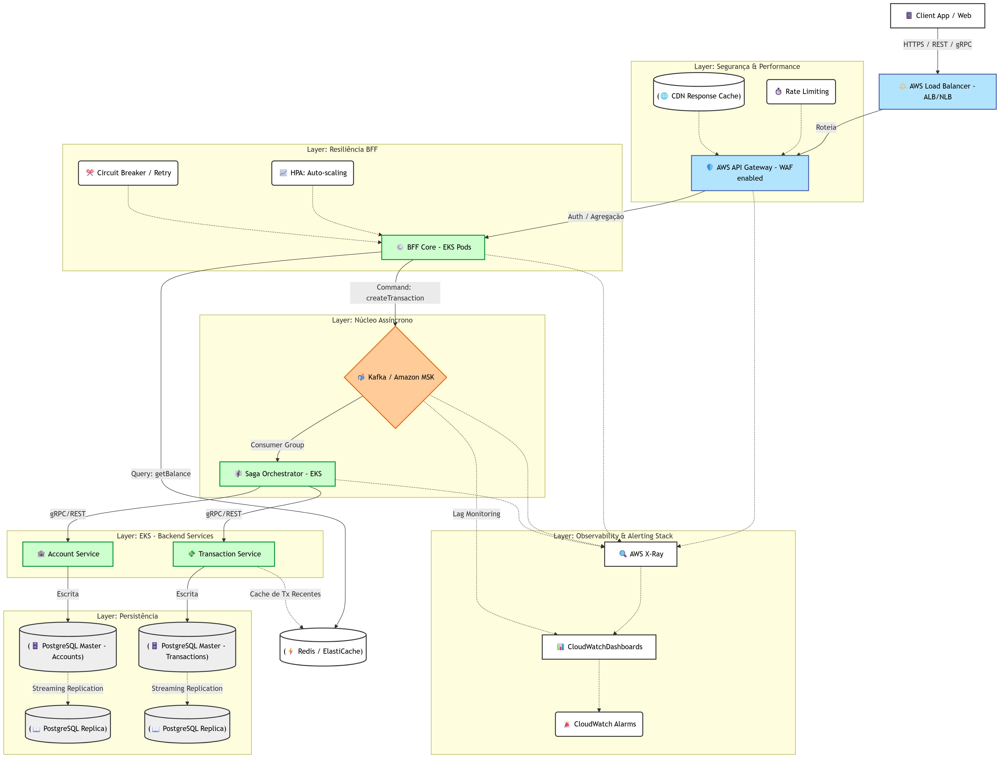
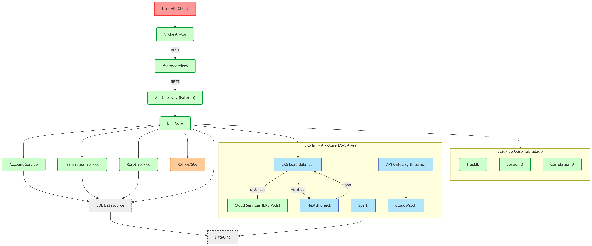

# Core Banking API
A RESTful API built with Spring Boot for managing accounts, balances, and financial transactions. Supports creating accounts, querying balances, and handling deposits, withdrawals, and transfers.

## Configuration 

Project was designed with java spring boot and maven. For run project with maven.
Granted install all dependencies with maven and java in your machine. 

### Principal core engineering
- Create account if it doest exist.
- Increase balance
- Validate balance + overdraft
- Decrease balance
- Validate Origin balance
- Debit Origin
- Credit destination
- Exception handling: monitoring error
- Checking data entry

- Running with dev config settings
  ```bash
  mvn clean install

- Running with dev config settings
  ```bash
  mvn spring-boot:run -Dspring-boot.run.profiles=dev

## Server Port
[http://localhost:8080/api](http://localhost:8080/api)

## Basic Architecture

**Controller → Service → Repository → Model** 

> Event-driven transactions (DEPOSIT, WITHDRAW, TRANSFER) 

> Separation of concerns

> Stateless REST API

> In-memory data storage (Hash structure, list map)

## Endpoints to test

### Accounts
- **Method:** `POST`
- **Endpoint:** `/api/accounts`
- **Description:** Creates a new account.
- **Request Example:**
  ```bash
  curl -X POST "http://localhost:8080/api/accounts" \
  -H "Content-Type: application/json" \
  -d '{"documentNumber":"12345678900"}'

### Get account
- **Method:** `GET`
- **Endpoint:** `/api/accounts/{accountId}`
- **Description:** Retrieves account details by ID.
- **Request Example:**
  ```bash
  curl -X GET "http://localhost:8080/api/accounts/66f4ac85-311e-41b9-8f76-2428ba68b7f4"

### Get Balance
- **Method:** `GET`
- **Endpoint:** `/api/accounts/balance`
- **Description:** Returns the balance of a specific account.
- **Parameters:** account_id (String): The identifyer of the account whose balance is to be retrieved.
- **Request Example:**
  ```bash
  curl -X GET "http://localhost:8080/api/accounts/balance?account_id=66f4ac85-311e-41b9-8f76-2428ba68b7f4"


### Set Overdraft
- **Method:** `POST`
- **Endpoint:** `/api/accounts/overdraft`
- **Description:** Set new value for overdraft limit.
- **Parameters:** account_id (String): The identifyer of the account whose balance is to be retrieved.
- **Request Example:**
  ```bash
  curl -X POST "http://localhost:8080/api/accounts/overdraft" \
  -H "Content-Type: application/json" \
  -d '{"accountId":"66f4ac85-311e-41b9-8f76-2428ba68b7f4","limit":500}'

### Reset State
- **Method:** `POST`
- **Endpoint:** `/api/accounts/reset`
- **Description:** Resets all accounts and balances, bringing the application back to its initial state.
- **Request Example:**
  ```bash
  curl -X POST "http://localhost:8080/api/accounts/reset"

### Transactions
- **Method:** `POST`
- **Endpoint:** `/api/transactions`
- **Description:** Create transaction in sequence of create account.
- **Request Example:**
  ```bash
  curl -X POST "http://localhost:8080/api/transactions" \
  -H "Content-Type: application/json" \
  -d '{"accountId":"ACCOUNT_ID","operationTypeId":4,"amount":100}'

### Get Transactions by day
- **Method:** `GET`
- **Endpoint:** `/api/transactions/today`
- **Description:** Find transactions in date references.
- **Request Example:**
  ```bash
  curl -X GET "http://localhost:8080/api/transactions/today"


### Get Transactions in Range
- **Method:** `GET`
- **Endpoint:** `/api/transactions/range`
- **Description:** Find transactions in date references.
- **queryParameters:** Begin and end, both date time format. 
- **Request Example:**
  ```bash
  curl -X GET "http://localhost:8080/api/transactions/range?begin=2025-08-16T00:00:00&end=2025-08-16T23:59:59"


### Withdraw
- **Method:** `POST`
- **Endpoint:** `/api/transactions/event`
- **Description:** Withdraw money from an account, considering balance + overdraft.
- **Request Example:**
  ```bash
  curl -X POST http://localhost:8080/api/transactions/event \
  -H "Content-Type: application/json" \
  -d '{
    "type": "WITHDRAW",
    "origin": "100",
    "amount": 50
  }'
  
### Transfer
- **Method:** `POST`
- **Endpoint:** `/api/transactions/event`
- **Description:** Transfer money from one account to another.
- **Request Example:**
  ```bash
  curl -X POST http://localhost:8080/api/transactions/event \
  -H "Content-Type: application/json" \
  -d '{
    "type": "TRANSFER",
    "origin": "100",
    "destination": "200",
    "amount": 30
}'
  

### Deposit
- **Method:** `POST`
- **Endpoint:** `/api/transactions/event`
- **Description:** Create a deposit into an account. If the account does not exist, it will be created.
- **Request Example:**
  ```bash
  curl -X POST http://localhost:8080/api/transactions/event \
  -H "Content-Type: application/json" \
  -d '{
    "type": "DEPOSIT",
    "destination": "100",
    "amount": 100
}'

### Abstract Arquitecture to engage high performance
This is the diagram for building the next stages of the cloud architecture and the tools that can be used in the sourcing project.




### Scheme logic simple
This diagram is simple for relating business rules.



### Notes:
- This structure was built with [Spring Initializr](https://start.spring.io/).
- This API was built with Spring Initializer.
- Using JUnit 5 for unit test layer with mockito.
- Java version: 17 [Java](https://docs.oracle.com/en/java/).
- Project management: Maven [Maven](https://maven.apache.org/guides/index.html).